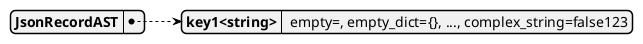
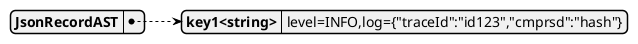
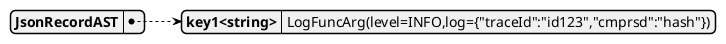
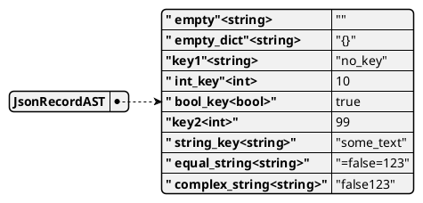
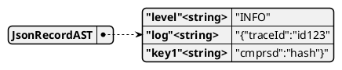
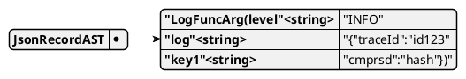
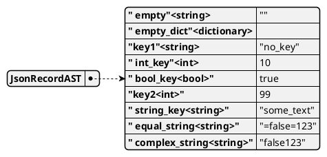
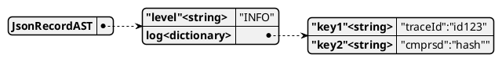
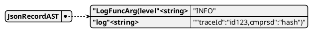

# Json-like Parsers

Below demonstrates 3 different json-like parsers: 1. a
[naive parser](#1-naive-parser) that assigns a key to the json-like string and
returns the entire string as a single object; 2. a
[simple parser](#2-simple-parser) that parses json-like strings, integers,
and booleans; and, 3. an [advance parser](#3-advanced-parser) that extends the
simple parser to dictionaries. 

## 1. Naive Parser

A naive parser that returns the entire json-like string as a single json
string.

### A. Theoretical representation
```
string:.+
JsonRecord -> string
```

### B. Code implementation

```
static auto json_record_rule(NonTerminal* m) -> unique_ptr<ParserAST> {
    auto value = make_unique<JsonValueAST>(m->token_cast(0)->to_string(), JsonValueType::String);
    auto object = make_unique<JsonObjectAST>(0, value);
    return make_unique<JsonRecordAST>(object);
}

void CustomParser::add_lexical_rules() {
    // default constructs to a m_negate group
    unique_ptr<RegexASTGroupByte> string_character = make_unique<RegexASTGroupByte>();
    unique_ptr<RegexASTMultiplicationByte> string_character_plus
        = make_unique<RegexASTMultiplicationByte>(std::move(string_character), 1, 0);
    add_rule("string", std::move(string_character_plus));
}

void CustomParser::add_productions() {   
    add_production("JsonRecord", {"string"}, json_record_rule);
}
```
### C. Example Outputs

```
std::string json_like_string
        = " empty=, empty_dict={}, no_key, int_key=10, bool_key=true, 99,"
          " string_key=some_text, equal_string==false=123, complex_string=false123";
log_surgeon:CustomParser custom_parser;
auto ast = custom_parser.parse_input(json_like_string);
auto* json_like_ast = static_cast<JsonRecordAST>(ast.get()); 
```

<!--

-->


```

std::string json_like_string
        = "level=INFO,log={"traceId":"id123","cmprsd":"hash"}"
log_surgeon:CustomParser custom_parser;
auto ast = custom_parser.parse_input(json_like_string);
auto* json_like_ast = static_cast<JsonRecordAST>(ast.get()); 
```

<!--

-->


```
std::string json_like_string
        = "LogFuncArg(level=INFO,log={"traceId":"id123","cmprsd":"hash"})"
log_surgeon:CustomParser custom_parser;
auto ast = custom_parser.parse_input(json_like_string);
auto* json_like_ast = static_cast<JsonRecordAST>(ast.get()); 
```

<!--

-->


## 2. Simple Parser

A simple parser that returns json strings, integers, and booleans.

### A. Theoretical representation
```
comma:,
equal:=
integer:[0-9]+
boolean:(true)|(false)
string:[^{},=]+
JsonRecord --> JsonRecord comma GoodJsonObject
           --> GoodJsonObject
           --> JsonRecord comma BadJsonObject
           --> BadJsonObject
GoodJsonObject --> GoodJsonObject equal
               --> GoodJsonObject Value
               --> BadJsonObject equal
BadJsonObject --> BadJsonObject Value
              --> Value
Value --> string
      --> boolean
      --> integer
```

### B. Code implementation
The code fragments can be found in [CustomParser.cpp][1]
```
void CustomParser::add_lexical_rules() {
    add_token("comma", ',');
    add_token("equal", '=');
    auto digit = make_unique<RegexASTGroupByte>('0', '9');
    auto digit_plus = make_unique<RegexASTMultiplicationByte>(std::move(digit), 1, 0);
    add_rule("integer", std::move(digit_plus));
    add_token_chain("boolean", "true");
    add_token_chain("boolean", "false");
    // default constructs to a m_negate group
    unique_ptr<RegexASTGroupByte> string_character = make_unique<RegexASTGroupByte>();
    string_character->add_literal(',');
    string_character->add_literal('=');
    unique_ptr<RegexASTMultiplicationByte> string_character_plus
            = make_unique<RegexASTMultiplicationByte>(std::move(string_character), 1, 0);
    add_rule("string", std::move(string_character_plus));
}
void CustomParser::add_productions() {   
    add_production(
            "JsonRecord",
            {"JsonRecord", "comma", "GoodJsonObject"},
            existing_json_record_rule
    );
    add_production("JsonRecord", {"GoodJsonObject"}, new_json_record_rule);
    add_production(
            "JsonRecord",
            {"JsonRecord", "comma", "BadJsonObject"},
            existing_json_record_rule
    );
    add_production("JsonRecord", {"BadJsonObject"}, new_json_record_rule);
    add_production("GoodJsonObject", {"GoodJsonObject", "equal"}, char_json_object_rule);
    add_production("GoodJsonObject", {"GoodJsonObject", "Value"}, existing_json_object_rule);
    add_production("GoodJsonObject", {"BadJsonObject", "equal"}, new_good_json_object_rule);
    add_production("BadJsonObject", {"BadJsonObject", "Value"}, existing_json_object_rule);
    add_production(
            "BadJsonObject",
            {"Value"},
            std::bind(&CustomParser::bad_json_object_rule, this, std::placeholders::_1)
    );
    add_production("Value", {"string"}, new_string_rule);
    add_production("Value", {"boolean"}, boolean_rule);
    add_production("Value", {"integer"}, integer_rule);
}
```
### C. Example Outputs

```
std::string json_like_string
        = " empty=, empty_dict={}, no_key, int_key=10, bool_key=true, 99,"
          " string_key=some_text, equal_string==false=123, complex_string=false123";
log_surgeon:CustomParser custom_parser;
auto ast = custom_parser.parse_input(json_like_string);
auto* json_like_ast = static_cast<JsonRecordAST>(ast.get()); 
```

<!--

-->


```
std::string json_like_string
        = "level=INFO,log={"traceId":"id123","cmprsd":"hash"}"
log_surgeon:CustomParser custom_parser;
auto ast = custom_parser.parse_input(json_like_string);
auto* json_like_ast = static_cast<JsonRecordAST>(ast.get()); 
```

<!--

-->


```
std::string json_like_string
        = "LogFuncArg(level=INFO,log={"traceId":"id123","cmprsd":"hash"})"
log_surgeon:CustomParser custom_parser;
auto ast = custom_parser.parse_input(json_like_string);
auto* json_like_ast = static_cast<JsonRecordAST>(ast.get()); 
```

<!--

-->


## 3. Advanced Parser

An advanced parser that extends the simple parser to include json dictionaries.

### A. Extended Theoretical representation
This extends the [simple parser representation](#a-theoretical-representation-1)
by adding the following rules:
```
lBrace:{
rBrace:}
Value --> lBrace JsonRecord rBrace
      --> lBrace rBrace
```

### B. Extended Code implementation
The additional code for these new rules is below.
```
static auto dictionary_rule(NonTerminal* m) -> unique_ptr<ParserAST> {
    unique_ptr<ParserAST>& r2 = m->non_terminal_cast(1)->get_parser_ast();
    return make_unique<JsonValueAST>(std::move(r2));
}

static auto empty_dictionary_rule(NonTerminal*) -> unique_ptr<ParserAST> {
    return make_unique<JsonValueAST>(nullptr);
}

void CustomParser::add_lexical_rules() {
    add_token("lBrace", '{');
    add_token("rBrace", '}');
    ...
    string_character->add_literal('{');
    string_character->add_literal('}');
    ...
}
void CustomParser::add_productions() {   
    ...
    add_production("Value", {"lBrace", "JsonRecord", "rBrace"}, dictionary_rule);
    add_production("Value", {"lBrace", "rBrace"}, empty_dictionary_rule);
}
```
### C. Example Outputs

```
std::string json_like_string
        = " empty=, empty_dict={}, no_key, int_key=10, bool_key=true, 99,"
          " string_key=some_text, equal_string==false=123, complex_string=false123";
log_surgeon:CustomParser custom_parser;
auto ast = custom_parser.parse_input(json_like_string);
auto* json_like_ast = static_cast<JsonRecordAST>(ast.get()); 
```

<!--

-->


```
std::string json_like_string
        = "level=INFO,log={"traceId":"id123","cmprsd":"hash"}"
log_surgeon:CustomParser custom_parser;
auto ast = custom_parser.parse_input(json_like_string);
auto* json_like_ast = static_cast<JsonRecordAST>(ast.get()); 
```

<!--

-->


```
std::string json_like_string
        = "LogFuncArg(level=INFO,log={"traceId":"id123","cmprsd":"hash"})"
log_surgeon:CustomParser custom_parser;
auto ast = custom_parser.parse_input(json_like_string);
auto* json_like_ast = static_cast<JsonRecordAST>(ast.get()); 
```

<!--

-->


### D. Potential Issues

The advanced parser separates out lBrace and rBrace as symbols captured
separately from string tokens. However, these braces are only used in dictionary
grammar rules. This means that if braces appear anywhere else, the parser will
determine the input to be an invalid json-like string and throw an
std::runtime_error similar to what is shown below.

```
File:1:9: error: expected '{','}','integer','boolean','string','JsonRecord','GoodJsonObject', 'BadJsonObject','Value' before ',' token
           empty={, empty_dict={}, no_key, int_key=10, bool_key=true, 99, string_key=some_text, equal_string==false=123, complex_string=false123
                  ^
``` 

[CustomParser.cpp][1]:

[1]: ../src/log_surgeon/CustomParser.cpp
